# Diagrama ER - Base de Datos Lottery System

## Diagrama Completo

```mermaid
erDiagram
    %% ============================================
    %% MÓDULO: GEOGRAFÍA Y LOTERÍAS
    %% ============================================

    countries ||--o{ zones : "has"
    countries ||--o{ lotteries_copy : "has"
    countries ||--o{ lotteries : "has_legacy"

    countries {
        int country_id PK
        nvarchar country_name
        nvarchar country_code
        bit is_active
        datetime2 created_at
    }

    zones {
        int zone_id PK
        int country_id FK
        nvarchar zone_name
        nvarchar zone_code
        bit is_active
    }

    lotteries_copy {
        int lottery_id PK "IDENTITY"
        int country_id FK
        nvarchar lottery_name
        nvarchar lottery_type
        nvarchar description
        bit is_active
        int display_order
    }

    lotteries {
        int lottery_id PK "LEGACY"
        int country_id FK
        nvarchar lottery_name
        nvarchar lottery_type
        bit is_active
    }

    lotteries_copy ||--o{ draws : "has_many"

    draws {
        int draw_id PK "IDENTITY"
        int lottery_id FK
        nvarchar draw_name
        time draw_time
        varchar abbreviation
        varchar display_color
        bit is_active
    }

    %% ============================================
    %% MÓDULO: TIPOS DE JUEGO Y BET TYPES
    %% ============================================

    game_categories ||--o{ game_types : "has"

    game_categories {
        int category_id PK
        nvarchar category_name
        nvarchar category_code
    }

    game_types {
        int game_type_id PK
        int category_id FK
        nvarchar game_type_name
        nvarchar game_type_code
        int min_numbers
        int max_numbers
    }

    bet_types {
        int bet_type_id PK
        nvarchar bet_type_code
        nvarchar bet_type_name
        nvarchar description
    }

    bet_types ||--o{ prize_fields : "has"

    prize_fields {
        int prize_field_id PK
        int bet_type_id FK
        nvarchar field_code
        nvarchar field_name
        decimal default_multiplier
        int display_order
    }

    lotteries ||--o{ lottery_game_compatibility : "compatible_with"
    game_types ||--o{ lottery_game_compatibility : "compatible_with"

    lottery_game_compatibility {
        int compatibility_id PK
        int lottery_id FK
        int game_type_id FK
        bit is_active
    }

    lotteries ||--o{ lottery_bet_type_compatibility : "supports"
    bet_types ||--o{ lottery_bet_type_compatibility : "supported_by"

    lottery_bet_type_compatibility {
        int compatibility_id PK
        int lottery_id FK
        int bet_type_id FK
        bit is_active
    }

    %% ============================================
    %% MÓDULO: USUARIOS Y PERMISOS
    %% ============================================

    roles ||--o{ users : "has"
    roles ||--o{ role_permissions : "has"
    permissions ||--o{ role_permissions : "assigned_to"

    roles {
        int role_id PK
        nvarchar role_name
        nvarchar role_code
        nvarchar description
    }

    users {
        int user_id PK "IDENTITY"
        nvarchar username
        nvarchar password_hash
        nvarchar email
        nvarchar full_name
        int role_id FK
        decimal commission_rate
        bit is_active
    }

    permissions {
        int permission_id PK "IDENTITY"
        nvarchar permission_code
        nvarchar permission_name
        nvarchar category
        nvarchar description
    }

    role_permissions {
        int role_permission_id PK
        int role_id FK
        int permission_id FK
    }

    users ||--o{ user_permissions : "has_direct"
    permissions ||--o{ user_permissions : "granted_to"

    user_permissions {
        int user_permission_id PK "IDENTITY"
        int user_id FK
        int permission_id FK
        datetime2 granted_at
    }

    users ||--o{ user_zones : "assigned_to"
    zones ||--o{ user_zones : "has_users"

    user_zones {
        int user_zone_id PK "IDENTITY"
        int user_id FK
        int zone_id FK
        datetime2 assigned_at
    }

    %% ============================================
    %% MÓDULO: BANCAS (BETTING POOLS)
    %% ============================================

    zones ||--o{ betting_pools : "has"
    banks ||--o{ betting_pools : "manages"

    banks {
        int bank_id PK
        nvarchar bank_name
        nvarchar bank_code
        bit is_active
    }

    betting_pools {
        int betting_pool_id PK "IDENTITY"
        nvarchar betting_pool_code
        nvarchar betting_pool_name
        int zone_id FK
        int bank_id FK
        nvarchar address
        nvarchar phone
        bit is_active
    }

    betting_pools ||--o{ betting_pool_config : "has"
    betting_pools ||--o{ betting_pool_print_config : "has"
    betting_pools ||--o{ betting_pool_discount_config : "has"
    betting_pools ||--o{ betting_pool_schedules : "has"
    betting_pools ||--o{ betting_pool_sortitions : "has"

    betting_pool_config {
        int config_id PK
        int betting_pool_id FK
        decimal global_discount
        decimal min_bet_amount
        decimal max_bet_amount
    }

    betting_pool_print_config {
        int config_id PK
        int betting_pool_id FK
        nvarchar printer_name
        nvarchar paper_size
    }

    betting_pool_discount_config {
        int config_id PK
        int betting_pool_id FK
        decimal discount_rate
        decimal min_amount
    }

    betting_pool_schedules {
        int schedule_id PK
        int betting_pool_id FK
        nvarchar day_of_week
        time open_time
        time close_time
    }

    betting_pool_sortitions {
        int sortition_id PK
        int betting_pool_id FK
        int sortition_number
        time sortition_time
    }

    users ||--o{ user_betting_pools : "works_at"
    betting_pools ||--o{ user_betting_pools : "has_employees"

    user_betting_pools {
        int user_betting_pool_id PK
        int user_id FK
        int betting_pool_id FK
        datetime2 assigned_at
    }

    %% ============================================
    %% MÓDULO: PREMIOS Y CONFIGURACIÓN
    %% ============================================

    betting_pools ||--o{ banca_prize_configs : "configures"
    prize_fields ||--o{ banca_prize_configs : "configured_in"

    banca_prize_configs {
        int config_id PK
        int betting_pool_id FK
        int prize_field_id FK
        decimal custom_value
        datetime2 created_at
    }

    betting_pools ||--o{ draw_prize_configs : "configures_draw"
    prize_fields ||--o{ draw_prize_configs : "configured_in_draw"

    draw_prize_configs {
        int config_id PK
        int betting_pool_id FK
        int draw_id FK
        int prize_field_id FK
        decimal custom_value
    }

    betting_pools ||--o{ betting_pool_prizes_commissions : "has"
    lotteries ||--o{ betting_pool_prizes_commissions : "configured_for"

    betting_pool_prizes_commissions {
        int config_id PK
        int betting_pool_id FK
        int lottery_id FK
        decimal prize_percentage
        decimal commission_rate
    }

    betting_pools ||--o{ betting_pool_draws : "participates_in"

    betting_pool_draws {
        int pool_draw_id PK
        int betting_pool_id FK
        int draw_id FK
        bit is_active
    }

    %% ============================================
    %% MÓDULO: TICKETS Y APUESTAS
    %% ============================================

    betting_pools ||--o{ tickets : "sells"
    users ||--o{ tickets : "created_by"

    tickets {
        int ticket_id PK "IDENTITY"
        int betting_pool_id FK
        int user_id FK
        nvarchar ticket_number
        decimal total_amount
        datetime2 ticket_date
        nvarchar status
    }

    tickets ||--o{ ticket_lines : "contains"
    lotteries ||--o{ ticket_lines : "for"
    game_types ||--o{ ticket_lines : "type"

    ticket_lines {
        int line_id PK "IDENTITY"
        int ticket_id FK
        int lottery_id FK
        int draw_id FK
        int bet_type_id FK
        nvarchar numbers
        decimal bet_amount
        decimal prize_amount
    }

    %% ============================================
    %% MÓDULO: RESULTADOS Y PREMIOS
    %% ============================================

    results {
        int result_id PK
        int draw_id FK
        datetime2 result_date
        nvarchar winning_numbers
        nvarchar status
    }

    results ||--o{ prizes : "generates"
    ticket_lines ||--o{ prizes : "wins"

    prizes {
        int prize_id PK
        int result_id FK
        int line_id FK
        decimal prize_amount
        nvarchar prize_type
        bit is_paid
    }

    %% ============================================
    %% MÓDULO: FINANCIERO Y AUDITORÍA
    %% ============================================

    betting_pools ||--o{ balances : "has"

    balances {
        int balance_id PK
        int betting_pool_id FK
        decimal current_balance
        datetime2 last_updated
    }

    betting_pools ||--o{ financial_transactions : "has"

    financial_transactions {
        int transaction_id PK
        int betting_pool_id FK
        nvarchar transaction_type
        decimal amount
        datetime2 transaction_date
    }

    betting_pools ||--o{ prize_changes_audit : "audit"
    prize_fields ||--o{ prize_changes_audit : "audit"
    users ||--o{ prize_changes_audit : "changed_by"

    prize_changes_audit {
        int audit_id PK
        int betting_pool_id FK
        int draw_id FK
        int prize_field_id FK
        int changed_by FK
        decimal old_value
        decimal new_value
        datetime2 changed_at
    }

    audit_log {
        int log_id PK
        int user_id FK
        nvarchar action
        nvarchar table_name
        nvarchar details
        datetime2 created_at
    }
```

## Resumen de Módulos

### 1. 🌍 Geografía y Loterías
- **countries** → **zones** → **betting_pools**
- **countries** → **lotteries_copy** → **draws** (✅ Nueva estructura)
- **countries** → **lotteries** (⚠️ Legacy)

### 2. 🎲 Tipos de Juego
- **game_categories** → **game_types**
- **bet_types** → **prize_fields**
- **lottery_game_compatibility** (N:M)
- **lottery_bet_type_compatibility** (N:M)

### 3. 👥 Usuarios y Permisos
- **roles** → **users**
- **permissions** → **user_permissions** (directo)
- **role_permissions** (por rol)
- **user_zones** (N:M)
- **user_betting_pools** (N:M)

### 4. 🏦 Bancas (Betting Pools)
- **betting_pools** + múltiples configuraciones
- **banca_prize_configs** (premios por banca)
- **draw_prize_configs** (premios por sorteo)

### 5. 🎫 Tickets y Resultados
- **tickets** → **ticket_lines**
- **results** → **prizes**

### 6. 💰 Financiero
- **balances**
- **financial_transactions**
- **prize_changes_audit**

## Cardinalidad

| Relación | Tipo | Descripción |
|----------|------|-------------|
| countries → lotteries_copy | 1:N | Un país tiene muchas loterías |
| lotteries_copy → draws | 1:N | Una lotería tiene muchos sorteos |
| betting_pools → tickets | 1:N | Una banca vende muchos tickets |
| tickets → ticket_lines | 1:N | Un ticket tiene muchas líneas |
| users → zones | N:M | Usuarios en múltiples zonas |
| lotteries → game_types | N:M | Compatibilidad lotería-juego |

## Claves de Identidad

✅ **Tablas con IDENTITY:**
- lotteries_copy
- draws
- users
- user_permissions
- user_zones
- betting_pools
- tickets
- ticket_lines

⚠️ **Tablas sin IDENTITY (legacy):**
- lotteries
- countries
- zones

