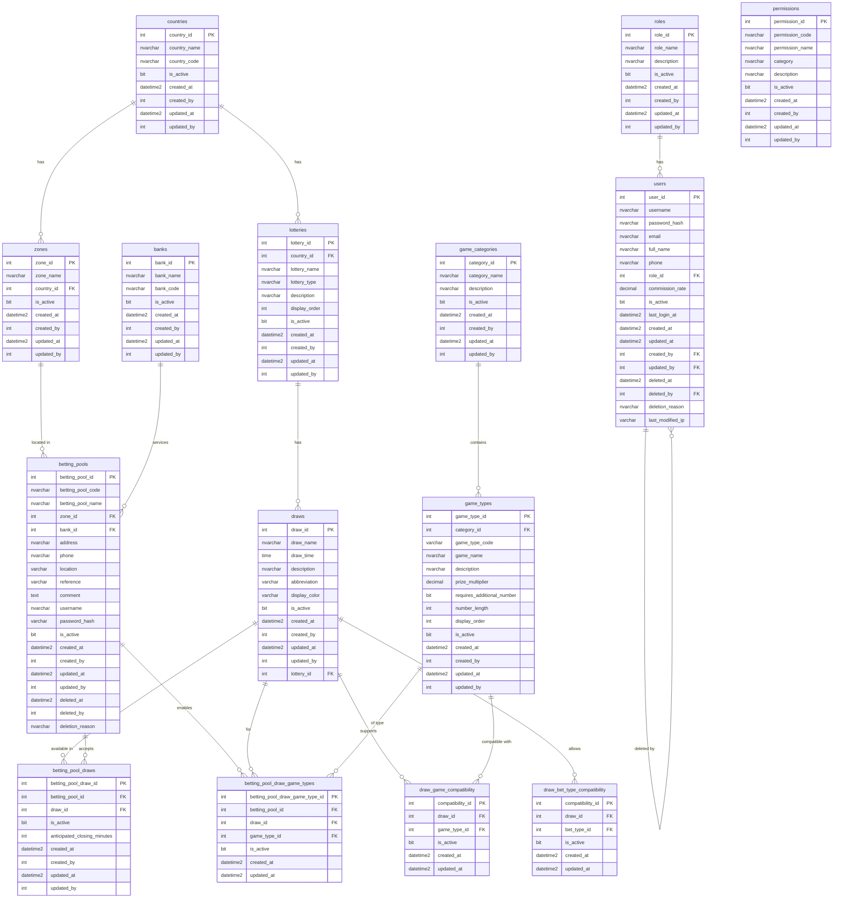

# Lottery Database Schema

## Entity Relationship Diagram



## Table Descriptions

### Core Geography and Organization

- **countries**: Master list of countries where lotteries operate
- **zones**: Geographic zones/regions within countries
- **banks**: Financial institutions servicing betting pools
- **lotteries**: Lottery brands/organizations (e.g., "Lotería Nacional Dominicana")
- **draws**: Specific drawing events/sorteos (e.g., "NACIONAL 7:55PM", "LOTEKA 12:55PM")

### Betting Pool Configuration

- **betting_pools**: Physical or virtual betting locations (bancas)
- **betting_pool_draws**: Which draws each banca accepts bets for
- **betting_pool_draw_game_types**: Which game types are enabled for each draw at each banca

### Game Configuration

- **game_categories**: Categories of games (e.g., "Straight", "Box", "Combination")
- **game_types**: Specific game types (e.g., "Pale", "Tripleta", "Quiniela")
- **draw_game_compatibility**: Which game types each draw supports
- **draw_bet_type_compatibility**: Which bet types each draw allows

### User Management

- **users**: System users with audit trails (created_by, updated_by, deleted_by)
- **roles**: User roles for access control
- **permissions**: Granular permissions (not yet linked to roles)

## Key Architectural Principles

1. **Draw-Centric Architecture**: `draw_id` is the primary business entity reference
2. **Lottery as Metadata**: `lottery_id` only exists in `lotteries` and `draws` tables - used for branding/display
3. **Hierarchical Structure**: Country → Lottery (brand) → Draw (actual event)
4. **N:M Relationships**: Betting pools can accept multiple draws, each draw can be at multiple pools
5. **Compatibility Tables**: Define which game types and bet types are allowed per draw
6. **Soft Deletes**: `deleted_at`, `deleted_by`, `deletion_reason` for audit trails

## Database Statistics

Total tables: 15 core tables
Total columns: 153 columns
Primary Keys: 15 (one per table)
Foreign Keys: ~25 relationships

## How to View This Diagram

### Option 1: GitHub/GitLab (Recommended)
This Mermaid diagram renders automatically in GitHub and GitLab markdown viewers.

### Option 2: Visual Studio Code
Install the "Markdown Preview Mermaid Support" extension:
```bash
code --install-extension bierner.markdown-mermaid
```

### Option 3: Mermaid Live Editor
Copy the diagram code and paste it into: https://mermaid.live

### Option 4: Azure Data Studio
1. Right-click on database
2. Select "Generate Script" → "Database Diagram"
3. Generates visual ERD

### Option 5: SQL Server Management Studio (SSMS)
1. Right-click on "Database Diagrams" folder
2. Select "New Database Diagram"
3. Select tables to include
4. Export as image

### Option 6: dbdiagram.io
Use the online tool at https://dbdiagram.io to create interactive diagrams.

## Schema Export Commands

### Export Full Schema (SQL)
```bash
sqlcmd -S lottery-sql-1505.database.windows.net \
  -d lottery-db-dev \
  -U sqladmin \
  -P 'yourpassword' \
  -Q "SELECT TABLE_NAME, COLUMN_NAME, DATA_TYPE, IS_NULLABLE
      FROM INFORMATION_SCHEMA.COLUMNS
      ORDER BY TABLE_NAME, ORDINAL_POSITION" \
  -o schema_full.txt
```

### Export with Relationships
```bash
sqlcmd -S lottery-sql-1505.database.windows.net \
  -d lottery-db-dev \
  -U sqladmin \
  -P 'yourpassword' \
  -i /tmp/extract_schema.sql \
  -o schema_with_fks.txt
```

## Generate dbdiagram.io Format

```dbdiagram
Table countries {
  country_id int [pk, increment]
  country_name nvarchar
  country_code nvarchar
  is_active bit
}

Table lotteries {
  lottery_id int [pk, increment]
  country_id int [ref: > countries.country_id]
  lottery_name nvarchar
  lottery_type nvarchar
}

Table draws {
  draw_id int [pk, increment]
  lottery_id int [ref: > lotteries.lottery_id]
  draw_name nvarchar
  draw_time time
}

// ... continue for all tables
```

Copy the dbdiagram format above to https://dbdiagram.io for an interactive diagram.

## Last Updated

Generated: 2025-11-14
Database: lottery-db-dev
Schema Version: Post-migration (draw-centric architecture)
