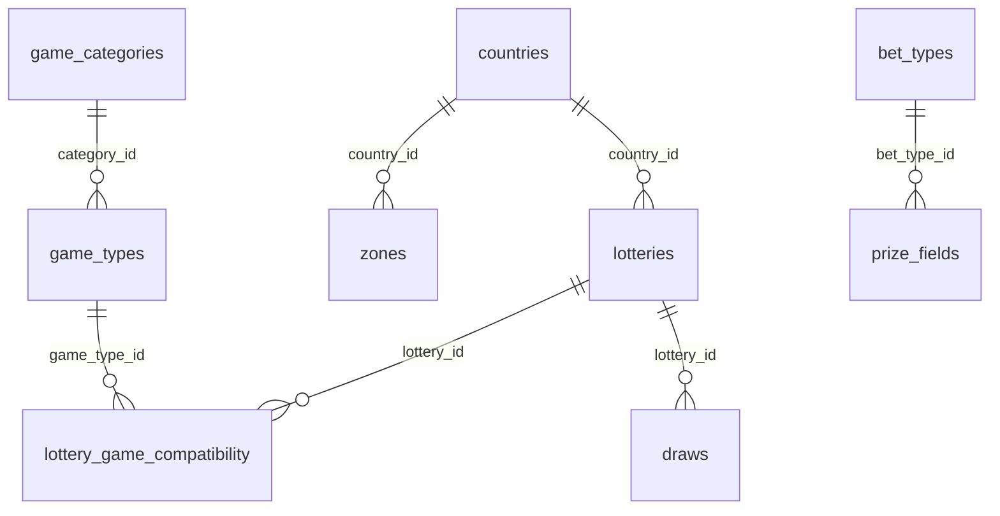
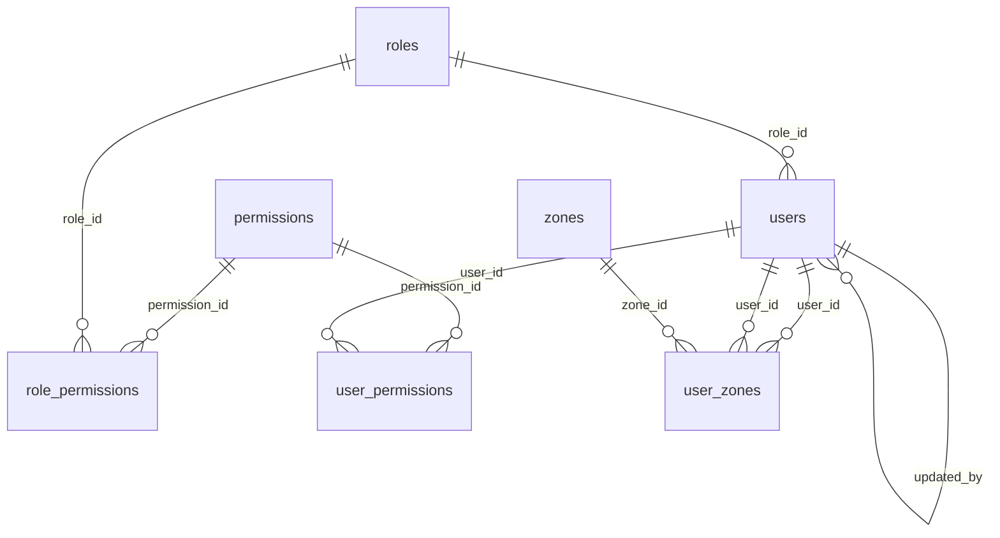
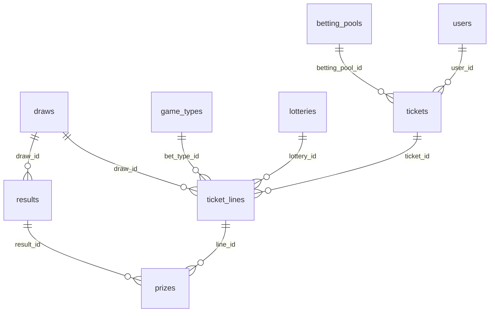

# Lottery Database - Schema Documentation

**Generated:** 2025-11-01 18:31:18

**Server:** lottery-sql-1505.database.windows.net

**Database:** lottery-db

---

## Table of Contents

1. [Database Overview](#database-overview)
2. [Table Statistics](#table-statistics)
3. [Entity Relationship Diagram](#entity-relationship-diagram)
4. [Table Descriptions](#table-descriptions)
5. [Foreign Key Relationships](#foreign-key-relationships)

---

## Database Overview

Total Tables: **48**

Total Records: **794**

Foreign Key Constraints: **62**

---

## Table Statistics

| Table Name | Records | Has Data |
|------------|--------:|---------|
| (47 rows affected) | 0 | ✗ |
| audit_log | 0 | ✗ |
| balances | 0 | ✗ |
| banca_prize_configs | 1 | ✓ |
| banks | 0 | ✗ |
| bet_types | 33 | ✓ |
| betting_pool_automatic_expenses | 0 | ✗ |
| betting_pool_config | 7 | ✓ |
| betting_pool_discount_config | 7 | ✓ |
| betting_pool_draw_config | 0 | ✗ |
| betting_pool_draws | 0 | ✗ |
| betting_pool_footers | 1 | ✓ |
| betting_pool_general_config | 0 | ✗ |
| betting_pool_print_config | 7 | ✓ |
| betting_pool_prizes_commissions | 0 | ✗ |
| betting_pool_schedules | 0 | ✗ |
| betting_pool_sortitions | 0 | ✗ |
| betting_pool_styles | 0 | ✗ |
| betting_pools | 18 | ✓ |
| countries | 9 | ✓ |
| draw_prize_configs | 0 | ✗ |
| draws | 116 | ✓ |
| error_logs | 0 | ✗ |
| financial_transactions | 0 | ✗ |
| game_categories | 3 | ✓ |
| game_types | 21 | ✓ |
| hot_numbers | 0 | ✗ |
| limit_consumption | 0 | ✗ |
| limit_rules | 0 | ✗ |
| lotteries | 69 | ✓ |
| lottery_game_compatibility | 275 | ✓ |
| permissions | 61 | ✓ |
| prize_changes_audit | 0 | ✗ |
| prize_fields | 64 | ✓ |
| prizes | 0 | ✗ |
| results | 0 | ✗ |
| role_permissions | 0 | ✗ |
| roles | 0 | ✗ |
| ticket_lines | 0 | ✗ |
| tickets | 0 | ✗ |
| user_betting_pools | 0 | ✗ |
| user_betting_pools_backup | 0 | ✗ |
| user_permissions | 37 | ✓ |
| user_permissions_backup | 0 | ✗ |
| user_zones | 25 | ✓ |
| user_zones_backup | 0 | ✗ |
| users | 24 | ✓ |
| zones | 16 | ✓ |

---

## Entity Relationship Diagram

### Core Entities

### User Management

### Betting Pools

```mermaid
erDiagram
    betting_pools ||--o{ banca_prize_configs : "betting_pool_id"
    betting_pools ||--o{ betting_pool_automatic_expenses : "betting_pool_id"
    betting_pools ||--o{ betting_pool_config : "betting_pool_id"
    betting_pools ||--o{ betting_pool_discount_config : "betting_pool_id"
    betting_pools ||--o{ betting_pool_draw_config : "betting_pool_id"
    betting_pools ||--o{ betting_pool_draws : "betting_pool_id"
    betting_pools ||--o{ betting_pool_draws : "betting_pool_id"
    betting_pools ||--o{ betting_pool_general_config : "betting_pool_id"
    betting_pools ||--o{ betting_pool_print_config : "betting_pool_id"
    betting_pools ||--o{ betting_pool_prizes_commissions : "betting_pool_id"
    betting_pools ||--o{ betting_pool_schedules : "betting_pool_id"
    betting_pools ||--o{ betting_pool_sortitions : "betting_pool_id"
    betting_pools ||--o{ betting_pool_styles : "betting_pool_id"
```

### Tickets & Results

---

## Table Descriptions

### (47 rows affected)

**Records:** 0

---

### audit_log

**Records:** 0

**Columns:**

| Column | Type | Nullable | Default | PK | Identity |
|--------|------|----------|---------|----|---------|
| audit_id | bigint | No |  | ✓ | ✓ |
| table_name | varchar(100) | No |  |  |  |
| operation_type | varchar(20) | No |  |  |  |
| record_id | varchar(100) | No |  |  |  |
| old_values | nvarchar(-1) | Yes |  |  |  |
| new_values | nvarchar(-1) | Yes |  |  |  |
| changed_fields | varchar(-1) | Yes |  |  |  |
| user_id | int | Yes |  |  |  |
| username | varchar(50) | Yes |  |  |  |
| betting_pool_id | int | Yes |  |  |  |
| ip_address | varchar(50) | Yes |  |  |  |
| application | varchar(100) | Yes |  |  |  |
| operation_reason | nvarchar(500) | Yes |  |  |  |
| created_at | datetime2 | No | (getdate()) |  |  |

---

### balances

**Records:** 0

**Columns:**

| Column | Type | Nullable | Default | PK | Identity |
|--------|------|----------|---------|----|---------|
| balance_id | int | No |  | ✓ |  |
| betting_pool_id | int | No |  |  |  |
| current_balance | decimal | Yes | ((0.00)) |  |  |
| last_updated | datetime2 | Yes | (getdate()) |  |  |
| updated_by | int | Yes |  |  |  |

**Foreign Keys:**

- `betting_pool_id` → `betting_pools.betting_pool_id`

---

### banca_prize_configs

**Records:** 1

**Columns:**

| Column | Type | Nullable | Default | PK | Identity |
|--------|------|----------|---------|----|---------|
| config_id | int | No |  | ✓ | ✓ |
| betting_pool_id | int | No |  |  |  |
| prize_field_id | int | No |  |  |  |
| custom_value | decimal | No | ((0)) |  |  |
| created_at | datetime2 | No | (getutcdate()) |  |  |
| updated_at | datetime2 | Yes |  |  |  |

**Foreign Keys:**

- `betting_pool_id` → `betting_pools.betting_pool_id`
- `prize_field_id` → `prize_fields.prize_field_id`

---

### banks

**Records:** 0

**Columns:**

| Column | Type | Nullable | Default | PK | Identity |
|--------|------|----------|---------|----|---------|
| bank_id | int | No |  | ✓ |  |
| bank_name | nvarchar(100) | No |  |  |  |
| bank_code | nvarchar(10) | Yes |  |  |  |
| is_active | bit | Yes | ((1)) |  |  |
| created_at | datetime2 | Yes | (getdate()) |  |  |
| created_by | int | Yes |  |  |  |
| updated_at | datetime2 | Yes |  |  |  |
| updated_by | int | Yes |  |  |  |

**Referenced By:**

- `betting_pools`

---

### bet_types

**Records:** 33

**Columns:**

| Column | Type | Nullable | Default | PK | Identity |
|--------|------|----------|---------|----|---------|
| bet_type_id | int | No |  | ✓ | ✓ |
| bet_type_code | nvarchar(50) | No |  |  |  |
| bet_type_name | nvarchar(255) | No |  |  |  |
| description | nvarchar(-1) | Yes |  |  |  |
| display_order | int | No | ((1)) |  |  |
| is_active | bit | No | ((1)) |  |  |
| created_at | datetime2 | No | (getdate()) |  |  |
| updated_at | datetime2 | No | (getdate()) |  |  |

**Referenced By:**

- `prize_fields`

---

### betting_pool_automatic_expenses

**Records:** 0

**Columns:**

| Column | Type | Nullable | Default | PK | Identity |
|--------|------|----------|---------|----|---------|
| expense_id | int | No |  | ✓ |  |
| betting_pool_id | int | No |  |  |  |
| expense_type | varchar(50) | No |  |  |  |
| amount | decimal | Yes |  |  |  |
| percentage | decimal | Yes |  |  |  |
| frequency | varchar(50) | No |  |  |  |
| is_active | bit | Yes | ((1)) |  |  |
| created_at | datetime2 | Yes | (getdate()) |  |  |
| updated_at | datetime2 | Yes | (getdate()) |  |  |
| created_by | int | Yes |  |  |  |
| updated_by | int | Yes |  |  |  |

**Foreign Keys:**

- `betting_pool_id` → `betting_pools.betting_pool_id`

---

### betting_pool_config

**Records:** 7

**Columns:**

| Column | Type | Nullable | Default | PK | Identity |
|--------|------|----------|---------|----|---------|
| config_id | int | No |  | ✓ | ✓ |
| betting_pool_id | int | No |  |  |  |
| fall_type | nvarchar(50) | Yes | ('OFF') |  |  |
| deactivation_balance | decimal | Yes |  |  |  |
| daily_sale_limit | decimal | Yes |  |  |  |
| daily_balance_limit | decimal | Yes |  |  |  |
| temporary_additional_balance | decimal | Yes |  |  |  |
| credit_limit | decimal | Yes | ((0.00)) |  |  |
| is_active | bit | Yes | ((1)) |  |  |
| control_winning_tickets | bit | Yes | ((0)) |  |  |
| allow_jackpot | bit | Yes | ((1)) |  |  |
| enable_recharges | bit | Yes | ((1)) |  |  |
| allow_password_change | bit | Yes | ((1)) |  |  |
| cancel_minutes | int | Yes | ((30)) |  |  |
| daily_cancel_tickets | int | Yes |  |  |  |
| max_cancel_amount | decimal | Yes |  |  |  |
| max_ticket_amount | decimal | Yes |  |  |  |
| max_daily_recharge | decimal | Yes |  |  |  |
| payment_mode | nvarchar(50) | Yes | ('BANCA') |  |  |
| created_at | datetime2 | Yes |  |  |  |
| created_by | int | Yes |  |  |  |
| updated_at | datetime2 | Yes |  |  |  |
| updated_by | int | Yes |  |  |  |
| enable_temporary_balance | bit | No | ((0)) |  |  |

**Foreign Keys:**

- `betting_pool_id` → `betting_pools.betting_pool_id`

---

### betting_pool_discount_config

**Records:** 7

**Columns:**

| Column | Type | Nullable | Default | PK | Identity |
|--------|------|----------|---------|----|---------|
| discount_config_id | int | No |  | ✓ | ✓ |
| betting_pool_id | int | No |  |  |  |
| discount_provider | nvarchar(50) | Yes | ('GRUPO') |  |  |
| discount_mode | nvarchar(50) | Yes | ('OFF') |  |  |
| created_at | datetime2 | Yes |  |  |  |
| created_by | int | Yes |  |  |  |
| updated_at | datetime2 | Yes |  |  |  |
| updated_by | int | Yes |  |  |  |

**Foreign Keys:**

- `betting_pool_id` → `betting_pools.betting_pool_id`

---

### betting_pool_draw_config

**Records:** 0

**Columns:**

| Column | Type | Nullable | Default | PK | Identity |
|--------|------|----------|---------|----|---------|
| config_sorteo_id | int | No |  | ✓ | ✓ |
| betting_pool_id | int | No |  |  |  |
| draw_id | int | No |  |  |  |
| prize_field_id | int | No |  |  |  |
| is_active | bit | No | ((1)) |  |  |
| created_at | datetime2 | No | (getdate()) |  |  |
| updated_at | datetime2 | No | (getdate()) |  |  |
| created_by | int | Yes |  |  |  |
| updated_by | int | Yes |  |  |  |
| multiplier_amount | decimal | No |  |  |  |

**Foreign Keys:**

- `betting_pool_id` → `betting_pools.betting_pool_id`
- `created_by` → `users.user_id`
- `draw_id` → `draws.draw_id`
- `prize_field_id` → `prize_fields.prize_field_id`
- `updated_by` → `users.user_id`

---

### betting_pool_draws

**Records:** 0

**Columns:**

| Column | Type | Nullable | Default | PK | Identity |
|--------|------|----------|---------|----|---------|
| betting_pool_draw_id | int | No |  | ✓ |  |
| betting_pool_id | int | No |  |  |  |
| draw_id | int | No |  |  |  |
| is_active | bit | Yes | ((1)) |  |  |
| created_at | datetime2 | Yes | (getdate()) |  |  |
| created_by | int | Yes |  |  |  |
| updated_at | datetime2 | Yes |  |  |  |
| updated_by | int | Yes |  |  |  |

**Foreign Keys:**

- `betting_pool_id` → `betting_pools.betting_pool_id`
- `betting_pool_id` → `betting_pools.betting_pool_id`
- `draw_id` → `draws.draw_id`
- `draw_id` → `draws.draw_id`

---

### betting_pool_footers

**Records:** 1

**Columns:**

| Column | Type | Nullable | Default | PK | Identity |
|--------|------|----------|---------|----|---------|
| footer_id | int | No |  | ✓ | ✓ |
| betting_pool_id | int | No |  |  |  |
| auto_footer | bit | No |  |  |  |
| footer_line_1 | nvarchar(500) | Yes |  |  |  |
| footer_line_2 | nvarchar(500) | Yes |  |  |  |
| footer_line_3 | nvarchar(500) | Yes |  |  |  |
| footer_line_4 | nvarchar(500) | Yes |  |  |  |
| created_at | datetime2 | Yes |  |  |  |
| updated_at | datetime2 | Yes |  |  |  |
| created_by | int | Yes |  |  |  |
| updated_by | int | Yes |  |  |  |

---

### betting_pool_general_config

**Records:** 0

**Columns:**

| Column | Type | Nullable | Default | PK | Identity |
|--------|------|----------|---------|----|---------|
| config_id | int | No |  | ✓ | ✓ |
| betting_pool_id | int | No |  |  |  |
| prize_field_id | int | No |  |  |  |
| is_active | bit | No | ((1)) |  |  |
| created_at | datetime2 | No | (getdate()) |  |  |
| updated_at | datetime2 | No | (getdate()) |  |  |
| created_by | int | Yes |  |  |  |
| updated_by | int | Yes |  |  |  |
| multiplier_amount | decimal | No |  |  |  |

**Foreign Keys:**

- `betting_pool_id` → `betting_pools.betting_pool_id`
- `created_by` → `users.user_id`
- `prize_field_id` → `prize_fields.prize_field_id`
- `updated_by` → `users.user_id`

---

### betting_pool_print_config

**Records:** 7

**Columns:**

| Column | Type | Nullable | Default | PK | Identity |
|--------|------|----------|---------|----|---------|
| print_config_id | int | No |  | ✓ | ✓ |
| betting_pool_id | int | No |  |  |  |
| print_mode | nvarchar(50) | Yes | ('DRIVER') |  |  |
| print_enabled | bit | Yes | ((1)) |  |  |
| print_ticket_copy | bit | Yes | ((1)) |  |  |
| print_recharge_receipt | bit | Yes | ((1)) |  |  |
| sms_only | bit | Yes | ((0)) |  |  |
| created_at | datetime2 | Yes |  |  |  |
| created_by | int | Yes |  |  |  |
| updated_at | datetime2 | Yes |  |  |  |
| updated_by | int | Yes |  |  |  |

**Foreign Keys:**

- `betting_pool_id` → `betting_pools.betting_pool_id`

---

### betting_pool_prizes_commissions

**Records:** 0

**Columns:**

| Column | Type | Nullable | Default | PK | Identity |
|--------|------|----------|---------|----|---------|
| prize_commission_id | int | No |  | ✓ |  |
| betting_pool_id | int | No |  |  |  |
| lottery_id | int | No |  |  |  |
| game_type | varchar(50) | No |  |  |  |
| prize_payment_1 | decimal | Yes |  |  |  |
| prize_payment_2 | decimal | Yes |  |  |  |
| prize_payment_3 | decimal | Yes |  |  |  |
| prize_payment_4 | decimal | Yes |  |  |  |
| commission_discount_1 | decimal | Yes |  |  |  |
| commission_discount_2 | decimal | Yes |  |  |  |
| commission_discount_3 | decimal | Yes |  |  |  |
| commission_discount_4 | decimal | Yes |  |  |  |
| commission_2_discount_1 | decimal | Yes |  |  |  |
| commission_2_discount_2 | decimal | Yes |  |  |  |
| commission_2_discount_3 | decimal | Yes |  |  |  |
| commission_2_discount_4 | decimal | Yes |  |  |  |
| is_active | bit | Yes | ((1)) |  |  |
| created_at | datetime2 | Yes | (getdate()) |  |  |
| updated_at | datetime2 | Yes | (getdate()) |  |  |
| created_by | int | Yes |  |  |  |
| updated_by | int | Yes |  |  |  |

**Foreign Keys:**

- `betting_pool_id` → `betting_pools.betting_pool_id`
- `lottery_id` → `lotteries.lottery_id`

---

### betting_pool_schedules

**Records:** 0

**Columns:**

| Column | Type | Nullable | Default | PK | Identity |
|--------|------|----------|---------|----|---------|
| schedule_id | int | No |  | ✓ |  |
| betting_pool_id | int | No |  |  |  |
| day_of_week | int | No |  |  |  |
| close_time | time | Yes |  |  |  |
| draw_time | time | Yes |  |  |  |
| is_active | bit | Yes | ((1)) |  |  |
| created_at | datetime2 | Yes | (getdate()) |  |  |
| updated_at | datetime2 | Yes | (getdate()) |  |  |
| created_by | int | Yes |  |  |  |
| updated_by | int | Yes |  |  |  |

**Foreign Keys:**

- `betting_pool_id` → `betting_pools.betting_pool_id`

---

### betting_pool_sortitions

**Records:** 0

**Columns:**

| Column | Type | Nullable | Default | PK | Identity |
|--------|------|----------|---------|----|---------|
| sortition_id | int | No |  | ✓ |  |
| betting_pool_id | int | No |  |  |  |
| sortition_type | varchar(50) | No |  |  |  |
| is_enabled | bit | Yes | ((1)) |  |  |
| specific_config | nvarchar(-1) | Yes |  |  |  |
| created_at | datetime2 | Yes | (getdate()) |  |  |
| updated_at | datetime2 | Yes | (getdate()) |  |  |
| created_by | int | Yes |  |  |  |
| updated_by | int | Yes |  |  |  |

**Foreign Keys:**

- `betting_pool_id` → `betting_pools.betting_pool_id`

---

### betting_pool_styles

**Records:** 0

**Columns:**

| Column | Type | Nullable | Default | PK | Identity |
|--------|------|----------|---------|----|---------|
| style_id | int | No |  | ✓ |  |
| betting_pool_id | int | No |  |  |  |
| sales_point_style | varchar(50) | Yes | ('Estilo 1') |  |  |
| print_style | varchar(50) | Yes | ('Original') |  |  |
| ticket_colors | nvarchar(-1) | Yes |  |  |  |
| custom_logo | varchar(255) | Yes |  |  |  |
| font_settings | nvarchar(-1) | Yes |  |  |  |
| layout_config | nvarchar(-1) | Yes |  |  |  |
| created_at | datetime2 | Yes | (getdate()) |  |  |
| updated_at | datetime2 | Yes | (getdate()) |  |  |
| created_by | int | Yes |  |  |  |
| updated_by | int | Yes |  |  |  |

**Foreign Keys:**

- `betting_pool_id` → `betting_pools.betting_pool_id`

---

### betting_pools

**Records:** 18

**Columns:**

| Column | Type | Nullable | Default | PK | Identity |
|--------|------|----------|---------|----|---------|
| betting_pool_id | int | No |  | ✓ | ✓ |
| betting_pool_code | nvarchar(20) | No |  |  |  |
| betting_pool_name | nvarchar(100) | No |  |  |  |
| zone_id | int | No |  |  |  |
| bank_id | int | Yes |  |  |  |
| address | nvarchar(255) | Yes |  |  |  |
| phone | nvarchar(20) | Yes |  |  |  |
| location | varchar(255) | Yes |  |  |  |
| reference | varchar(255) | Yes |  |  |  |
| comment | text(2147483647) | Yes |  |  |  |
| username | nvarchar(100) | Yes |  |  |  |
| password_hash | varchar(255) | Yes |  |  |  |
| is_active | bit | Yes | ((1)) |  |  |
| created_at | datetime2 | Yes | (getdate()) |  |  |
| created_by | int | Yes |  |  |  |
| updated_at | datetime2 | Yes |  |  |  |
| updated_by | int | Yes |  |  |  |
| deleted_at | datetime2 | Yes |  |  |  |
| deleted_by | int | Yes |  |  |  |
| deletion_reason | nvarchar(500) | Yes |  |  |  |

**Foreign Keys:**

- `bank_id` → `banks.bank_id`
- `zone_id` → `zones.zone_id`

**Referenced By:**

- `balances`
- `banca_prize_configs`
- `betting_pool_automatic_expenses`
- `betting_pool_config`
- `betting_pool_discount_config`
- `betting_pool_draw_config`
- `betting_pool_draws`
- `betting_pool_general_config`
- `betting_pool_print_config`
- `betting_pool_prizes_commissions`
- `betting_pool_schedules`
- `betting_pool_sortitions`
- `betting_pool_styles`
- `draw_prize_configs`
- `prize_changes_audit`
- `tickets`
- `user_betting_pools`

---

### countries

**Records:** 9

**Columns:**

| Column | Type | Nullable | Default | PK | Identity |
|--------|------|----------|---------|----|---------|
| country_id | int | No |  | ✓ |  |
| country_name | nvarchar(100) | No |  |  |  |
| country_code | nvarchar(3) | No |  |  |  |
| is_active | bit | Yes | ((1)) |  |  |
| created_at | datetime2 | Yes | (getdate()) |  |  |
| created_by | int | Yes |  |  |  |
| updated_at | datetime2 | Yes |  |  |  |
| updated_by | int | Yes |  |  |  |

**Referenced By:**

- `lotteries`
- `zones`

---

### draw_prize_configs

**Records:** 0

**Columns:**

| Column | Type | Nullable | Default | PK | Identity |
|--------|------|----------|---------|----|---------|
| config_id | int | No |  | ✓ | ✓ |
| betting_pool_id | int | No |  |  |  |
| draw_id | int | No |  |  |  |
| prize_field_id | int | No |  |  |  |
| custom_value | decimal | No | ((0)) |  |  |
| created_at | datetime2 | No | (getutcdate()) |  |  |
| updated_at | datetime2 | Yes |  |  |  |

**Foreign Keys:**

- `betting_pool_id` → `betting_pools.betting_pool_id`
- `draw_id` → `draws.draw_id`
- `prize_field_id` → `prize_fields.prize_field_id`

---

### draws

**Records:** 116

**Columns:**

| Column | Type | Nullable | Default | PK | Identity |
|--------|------|----------|---------|----|---------|
| draw_id | int | No |  | ✓ |  |
| lottery_id | int | No |  |  |  |
| draw_name | nvarchar(100) | No |  |  |  |
| draw_time | time | No |  |  |  |
| description | nvarchar(500) | Yes |  |  |  |
| is_active | bit | Yes | ((1)) |  |  |
| created_at | datetime2 | Yes | (getdate()) |  |  |
| created_by | int | Yes |  |  |  |
| updated_at | datetime2 | Yes |  |  |  |
| updated_by | int | Yes |  |  |  |
| abbreviation | varchar(10) | Yes |  |  |  |
| display_color | varchar(7) | Yes |  |  |  |

**Foreign Keys:**

- `lottery_id` → `lotteries.lottery_id`

**Referenced By:**

- `betting_pool_draw_config`
- `betting_pool_draws`
- `draw_prize_configs`
- `prize_changes_audit`
- `results`
- `ticket_lines`

---

### error_logs

**Records:** 0

**Columns:**

| Column | Type | Nullable | Default | PK | Identity |
|--------|------|----------|---------|----|---------|
| error_log_id | bigint | No |  | ✓ | ✓ |
| error_source | varchar(100) | No |  |  |  |
| error_procedure | varchar(200) | Yes |  |  |  |
| error_number | int | Yes |  |  |  |
| error_severity | int | Yes |  |  |  |
| error_state | int | Yes |  |  |  |
| error_message | nvarchar(-1) | Yes |  |  |  |
| error_line | int | Yes |  |  |  |
| additional_info | nvarchar(-1) | Yes |  |  |  |
| user_id | int | Yes |  |  |  |
| betting_pool_id | int | Yes |  |  |  |
| ticket_id | bigint | Yes |  |  |  |
| session_id | varchar(100) | Yes |  |  |  |
| ip_address | varchar(50) | Yes |  |  |  |
| created_at | datetime2 | No | (getdate()) |  |  |

---

### financial_transactions

**Records:** 0

**Columns:**

| Column | Type | Nullable | Default | PK | Identity |
|--------|------|----------|---------|----|---------|
| transaction_id | bigint | No |  | ✓ | ✓ |
| transaction_type | varchar(50) | No |  |  |  |
| betting_pool_id | int | Yes |  |  |  |
| user_id | int | Yes |  |  |  |
| ticket_id | bigint | Yes |  |  |  |
| related_transaction_id | bigint | Yes |  |  |  |
| amount | decimal | No |  |  |  |
| balance_before | decimal | Yes |  |  |  |
| balance_after | decimal | Yes |  |  |  |
| currency | varchar(10) | No | ('DOP') |  |  |
| payment_method | varchar(50) | Yes |  |  |  |
| reference_number | varchar(100) | Yes |  |  |  |
| description | nvarchar(500) | Yes |  |  |  |
| status | varchar(20) | No | ('completed') |  |  |
| is_reversed | bit | No | ((0)) |  |  |
| reversed_by_transaction_id | bigint | Yes |  |  |  |
| reversed_at | datetime2 | Yes |  |  |  |
| created_at | datetime2 | No | (getdate()) |  |  |
| created_by | int | Yes |  |  |  |
| approved_by | int | Yes |  |  |  |
| approved_at | datetime2 | Yes |  |  |  |

---

### game_categories

**Records:** 3

**Columns:**

| Column | Type | Nullable | Default | PK | Identity |
|--------|------|----------|---------|----|---------|
| category_id | int | No |  | ✓ |  |
| category_name | nvarchar(100) | No |  |  |  |
| description | nvarchar(500) | Yes |  |  |  |
| is_active | bit | Yes | ((1)) |  |  |
| created_at | datetime2 | Yes | (getdate()) |  |  |
| created_by | int | Yes |  |  |  |
| updated_at | datetime2 | Yes |  |  |  |
| updated_by | int | Yes |  |  |  |

**Referenced By:**

- `game_types`

---

### game_types

**Records:** 21

**Columns:**

| Column | Type | Nullable | Default | PK | Identity |
|--------|------|----------|---------|----|---------|
| game_type_id | int | No |  | ✓ | ✓ |
| category_id | int | No |  |  |  |
| game_type_code | varchar(50) | No |  |  |  |
| game_name | nvarchar(100) | No |  |  |  |
| description | nvarchar(500) | Yes |  |  |  |
| prize_multiplier | decimal | Yes | ((1.00)) |  |  |
| requires_additional_number | bit | Yes | ((0)) |  |  |
| number_length | int | Yes | ((4)) |  |  |
| display_order | int | Yes |  |  |  |
| is_active | bit | Yes | ((1)) |  |  |
| created_at | datetime2 | Yes | (getdate()) |  |  |
| created_by | int | Yes |  |  |  |
| updated_at | datetime2 | Yes |  |  |  |
| updated_by | int | Yes |  |  |  |

**Foreign Keys:**

- `category_id` → `game_categories.category_id`

**Referenced By:**

- `lottery_game_compatibility`
- `ticket_lines`

---

### hot_numbers

**Records:** 0

**Columns:**

| Column | Type | Nullable | Default | PK | Identity |
|--------|------|----------|---------|----|---------|
| hot_number_id | bigint | No |  | ✓ | ✓ |
| lottery_id | int | No |  |  |  |
| draw_id | int | No |  |  |  |
| draw_date | date | No |  |  |  |
| bet_number | varchar(20) | No |  |  |  |
| total_bet_amount | decimal | No | ((0.00)) |  |  |
| bet_count | int | No | ((0)) |  |  |
| unique_tickets | int | No | ((0)) |  |  |
| unique_betting_pools | int | No | ((0)) |  |  |
| limit_percentage | decimal | Yes |  |  |  |
| is_near_limit | bit | No | ((0)) |  |  |
| is_at_limit | bit | No | ((0)) |  |  |
| last_updated | datetime2 | No | (getdate()) |  |  |

---

### limit_consumption

**Records:** 0

**Columns:**

| Column | Type | Nullable | Default | PK | Identity |
|--------|------|----------|---------|----|---------|
| consumption_id | bigint | No |  | ✓ | ✓ |
| limit_rule_id | int | No |  |  |  |
| lottery_id | int | No |  |  |  |
| draw_id | int | No |  |  |  |
| draw_date | date | No |  |  |  |
| bet_number | varchar(20) | No |  |  |  |
| betting_pool_id | int | Yes |  |  |  |
| current_amount | decimal | No | ((0.00)) |  |  |
| bet_count | int | No | ((0)) |  |  |
| last_bet_at | datetime2 | Yes |  |  |  |
| is_near_limit | bit | No | ((0)) |  |  |
| is_at_limit | bit | No | ((0)) |  |  |
| created_at | datetime2 | No | (getdate()) |  |  |
| updated_at | datetime2 | No | (getdate()) |  |  |

---

### limit_rules

**Records:** 0

**Columns:**

| Column | Type | Nullable | Default | PK | Identity |
|--------|------|----------|---------|----|---------|
| limit_rule_id | int | No |  | ✓ | ✓ |
| rule_name | nvarchar(100) | No |  |  |  |
| lottery_id | int | Yes |  |  |  |
| draw_id | int | Yes |  |  |  |
| game_type_id | int | Yes |  |  |  |
| bet_number_pattern | varchar(50) | Yes |  |  |  |
| max_bet_per_number | decimal | Yes |  |  |  |
| max_bet_per_ticket | decimal | Yes |  |  |  |
| max_bet_per_betting_pool | decimal | Yes |  |  |  |
| max_bet_global | decimal | Yes |  |  |  |
| is_active | bit | No | ((1)) |  |  |
| priority | int | Yes | ((100)) |  |  |
| effective_from | datetime2 | Yes |  |  |  |
| effective_to | datetime2 | Yes |  |  |  |
| created_at | datetime2 | No | (getdate()) |  |  |
| created_by | int | Yes |  |  |  |
| updated_at | datetime2 | Yes |  |  |  |
| updated_by | int | Yes |  |  |  |

---

### lotteries

**Records:** 69

**Columns:**

| Column | Type | Nullable | Default | PK | Identity |
|--------|------|----------|---------|----|---------|
| lottery_id | int | No |  | ✓ |  |
| country_id | int | No |  |  |  |
| lottery_name | nvarchar(100) | No |  |  |  |
| lottery_type | nvarchar(50) | Yes |  |  |  |
| description | nvarchar(500) | Yes |  |  |  |
| is_active | bit | Yes | ((1)) |  |  |
| created_at | datetime2 | Yes | (getdate()) |  |  |
| created_by | int | Yes |  |  |  |
| updated_at | datetime2 | Yes |  |  |  |
| updated_by | int | Yes |  |  |  |
| display_order | int | Yes |  |  |  |

**Foreign Keys:**

- `country_id` → `countries.country_id`

**Referenced By:**

- `betting_pool_prizes_commissions`
- `draws`
- `lottery_game_compatibility`
- `ticket_lines`

---

### lottery_game_compatibility

**Records:** 275

**Columns:**

| Column | Type | Nullable | Default | PK | Identity |
|--------|------|----------|---------|----|---------|
| compatibility_id | int | No |  | ✓ | ✓ |
| lottery_id | int | No |  |  |  |
| game_type_id | int | No |  |  |  |
| is_active | bit | No | ((1)) |  |  |
| created_at | datetime2 | No | (getdate()) |  |  |
| updated_at | datetime2 | No | (getdate()) |  |  |

**Foreign Keys:**

- `game_type_id` → `game_types.game_type_id`
- `lottery_id` → `lotteries.lottery_id`

---

### permissions

**Records:** 61

**Columns:**

| Column | Type | Nullable | Default | PK | Identity |
|--------|------|----------|---------|----|---------|
| permission_id | int | No |  | ✓ | ✓ |
| permission_code | nvarchar(100) | No |  |  |  |
| permission_name | nvarchar(200) | No |  |  |  |
| category | nvarchar(50) | No |  |  |  |
| description | nvarchar(500) | Yes |  |  |  |
| is_active | bit | Yes | ((1)) |  |  |
| created_at | datetime2 | Yes | (getdate()) |  |  |
| created_by | int | Yes |  |  |  |
| updated_at | datetime2 | Yes |  |  |  |
| updated_by | int | Yes |  |  |  |

**Referenced By:**

- `role_permissions`
- `user_permissions`

---

### prize_changes_audit

**Records:** 0

**Columns:**

| Column | Type | Nullable | Default | PK | Identity |
|--------|------|----------|---------|----|---------|
| audit_id | int | No |  | ✓ | ✓ |
| table_name | nvarchar(100) | No |  |  |  |
| record_id | int | No |  |  |  |
| betting_pool_id | int | No |  |  |  |
| draw_id | int | Yes |  |  |  |
| prize_field_id | int | No |  |  |  |
| old_value | decimal | Yes |  |  |  |
| new_value | decimal | No |  |  |  |
| change_type | nvarchar(50) | No |  |  |  |
| changed_by | int | No |  |  |  |
| changed_at | datetime2 | No | (getdate()) |  |  |
| ip_address | nvarchar(50) | Yes |  |  |  |
| user_agent | nvarchar(500) | Yes |  |  |  |
| notes | nvarchar(-1) | Yes |  |  |  |

**Foreign Keys:**

- `betting_pool_id` → `betting_pools.betting_pool_id`
- `changed_by` → `users.user_id`
- `draw_id` → `draws.draw_id`
- `prize_field_id` → `prize_fields.prize_field_id`

---

### prize_fields

**Records:** 64

**Columns:**

| Column | Type | Nullable | Default | PK | Identity |
|--------|------|----------|---------|----|---------|
| prize_field_id | int | No |  | ✓ | ✓ |
| bet_type_id | int | No |  |  |  |
| field_code | nvarchar(100) | No |  |  |  |
| field_name | nvarchar(255) | No |  |  |  |
| default_multiplier | decimal | No | ((0)) |  |  |
| min_multiplier | decimal | No | ((0)) |  |  |
| max_multiplier | decimal | No | ((9999999.99)) |  |  |
| display_order | int | No | ((1)) |  |  |
| is_active | bit | No | ((1)) |  |  |
| created_at | datetime2 | No | (getdate()) |  |  |
| updated_at | datetime2 | No | (getdate()) |  |  |

**Foreign Keys:**

- `bet_type_id` → `bet_types.bet_type_id`

**Referenced By:**

- `banca_prize_configs`
- `betting_pool_draw_config`
- `betting_pool_general_config`
- `draw_prize_configs`
- `prize_changes_audit`

---

### prizes

**Records:** 0

**Columns:**

| Column | Type | Nullable | Default | PK | Identity |
|--------|------|----------|---------|----|---------|
| prize_id | int | No |  | ✓ |  |
| result_id | int | No |  |  |  |
| line_id | bigint | No |  |  |  |
| prize_amount | decimal | Yes | ((0.00)) |  |  |
| prize_type | nvarchar(50) | Yes |  |  |  |
| created_at | datetime2 | Yes | (getdate()) |  |  |
| created_by | int | Yes |  |  |  |
| paid_at | datetime2 | Yes |  |  |  |
| paid_by | int | Yes |  |  |  |
| payment_method | varchar(50) | Yes |  |  |  |
| payment_reference | varchar(100) | Yes |  |  |  |

**Foreign Keys:**

- `line_id` → `ticket_lines.line_id`
- `result_id` → `results.result_id`

---

### results

**Records:** 0

**Columns:**

| Column | Type | Nullable | Default | PK | Identity |
|--------|------|----------|---------|----|---------|
| result_id | int | No |  | ✓ |  |
| draw_id | int | No |  |  |  |
| winning_number | nvarchar(20) | No |  |  |  |
| additional_number | nvarchar(10) | Yes |  |  |  |
| position | int | Yes |  |  |  |
| result_date | datetime2 | No |  |  |  |
| user_id | int | Yes |  |  |  |
| created_at | datetime2 | Yes | (getdate()) |  |  |
| created_by | int | Yes |  |  |  |
| updated_at | datetime2 | Yes |  |  |  |
| updated_by | int | Yes |  |  |  |
| approved_by | int | Yes |  |  |  |
| approved_at | datetime2 | Yes |  |  |  |

**Foreign Keys:**

- `draw_id` → `draws.draw_id`

**Referenced By:**

- `prizes`

---

### role_permissions

**Records:** 0

**Columns:**

| Column | Type | Nullable | Default | PK | Identity |
|--------|------|----------|---------|----|---------|
| role_permission_id | int | No |  | ✓ |  |
| role_id | int | No |  |  |  |
| permission_id | int | No |  |  |  |
| is_active | bit | Yes | ((1)) |  |  |
| created_at | datetime2 | Yes | (getdate()) |  |  |
| created_by | int | Yes |  |  |  |

**Foreign Keys:**

- `permission_id` → `permissions.permission_id`
- `role_id` → `roles.role_id`

---

### roles

**Records:** 0

**Columns:**

| Column | Type | Nullable | Default | PK | Identity |
|--------|------|----------|---------|----|---------|
| role_id | int | No |  | ✓ |  |
| role_name | nvarchar(50) | No |  |  |  |
| description | nvarchar(255) | Yes |  |  |  |
| is_active | bit | Yes | ((1)) |  |  |
| created_at | datetime2 | Yes | (getdate()) |  |  |
| created_by | int | Yes |  |  |  |
| updated_at | datetime2 | Yes |  |  |  |
| updated_by | int | Yes |  |  |  |

**Referenced By:**

- `role_permissions`
- `users`

---

### ticket_lines

**Records:** 0

**Columns:**

| Column | Type | Nullable | Default | PK | Identity |
|--------|------|----------|---------|----|---------|
| line_id | bigint | No |  | ✓ | ✓ |
| ticket_id | bigint | No |  |  |  |
| line_number | int | No |  |  |  |
| lottery_id | int | No |  |  |  |
| draw_id | int | No |  |  |  |
| draw_date | date | No |  |  |  |
| draw_time | time | No |  |  |  |
| bet_number | varchar(20) | No |  |  |  |
| bet_type_id | int | No |  |  |  |
| bet_type_code | varchar(50) | Yes |  |  |  |
| position | int | Yes |  |  |  |
| bet_amount | decimal | No |  |  |  |
| multiplier | decimal | Yes | ((1.00)) |  |  |
| discount_percentage | decimal | Yes | ((0.00)) |  |  |
| discount_amount | decimal | Yes | ((0.00)) |  |  |
| subtotal | decimal | No |  |  |  |
| total_with_multiplier | decimal | No |  |  |  |
| commission_percentage | decimal | Yes | ((0.00)) |  |  |
| commission_amount | decimal | Yes | ((0.00)) |  |  |
| net_amount | decimal | No |  |  |  |
| prize_multiplier | decimal | Yes |  |  |  |
| prize_amount | decimal | Yes | ((0.00)) |  |  |
| is_winner | bit | Yes | ((0)) |  |  |
| winning_position | int | Yes |  |  |  |
| result_number | varchar(20) | Yes |  |  |  |
| result_checked_at | datetime2 | Yes |  |  |  |
| line_status | varchar(20) | No | ('pending') |  |  |
| limit_rule_id | int | Yes |  |  |  |
| exceeds_limit | bit | Yes | ((0)) |  |  |
| limit_override_by | int | Yes |  |  |  |
| limit_override_reason | nvarchar(200) | Yes |  |  |  |
| created_at | datetime2 | No | (getdate()) |  |  |
| created_by | int | Yes |  |  |  |
| updated_at | datetime2 | Yes |  |  |  |
| updated_by | int | Yes |  |  |  |
| is_lucky_pick | bit | Yes | ((0)) |  |  |
| is_hot_number | bit | Yes | ((0)) |  |  |
| sequence_number | int | Yes |  |  |  |
| notes | nvarchar(500) | Yes |  |  |  |

**Foreign Keys:**

- `bet_type_id` → `game_types.game_type_id`
- `draw_id` → `draws.draw_id`
- `lottery_id` → `lotteries.lottery_id`
- `ticket_id` → `tickets.ticket_id`

**Referenced By:**

- `prizes`

---

### tickets

**Records:** 0

**Columns:**

| Column | Type | Nullable | Default | PK | Identity |
|--------|------|----------|---------|----|---------|
| ticket_id | bigint | No |  | ✓ | ✓ |
| ticket_code | varchar(20) | No |  |  |  |
| barcode | varchar(50) | Yes |  |  |  |
| betting_pool_id | int | No |  |  |  |
| user_id | int | No |  |  |  |
| terminal_id | varchar(20) | Yes |  |  |  |
| ip_address | varchar(45) | Yes |  |  |  |
| created_at | datetime2 | No | (getdate()) |  |  |
| global_multiplier | decimal | Yes | ((1.00)) |  |  |
| global_discount | decimal | Yes | ((0.00)) |  |  |
| currency_code | varchar(3) | Yes | ('DOP') |  |  |
| total_lines | int | Yes | ((0)) |  |  |
| total_bet_amount | decimal | Yes | ((0.00)) |  |  |
| total_discount | decimal | Yes | ((0.00)) |  |  |
| total_subtotal | decimal | Yes | ((0.00)) |  |  |
| total_with_multiplier | decimal | Yes | ((0.00)) |  |  |
| total_commission | decimal | Yes | ((0.00)) |  |  |
| total_net | decimal | Yes | ((0.00)) |  |  |
| grand_total | decimal | Yes | ((0.00)) |  |  |
| total_prize | decimal | Yes | ((0.00)) |  |  |
| winning_lines | int | Yes | ((0)) |  |  |
| status | varchar(20) | No | ('pending') |  |  |
| is_cancelled | bit | Yes | ((0)) |  |  |
| cancelled_at | datetime2 | Yes |  |  |  |
| cancelled_by | int | Yes |  |  |  |
| cancellation_reason | nvarchar(200) | Yes |  |  |  |
| is_paid | bit | Yes | ((0)) |  |  |
| paid_at | datetime2 | Yes |  |  |  |
| paid_by | int | Yes |  |  |  |
| payment_method | varchar(50) | Yes |  |  |  |
| payment_reference | varchar(100) | Yes |  |  |  |
| customer_id | int | Yes |  |  |  |
| customer_name | nvarchar(100) | Yes |  |  |  |
| customer_phone | varchar(20) | Yes |  |  |  |
| customer_email | varchar(100) | Yes |  |  |  |
| customer_id_number | varchar(50) | Yes |  |  |  |
| lottery_ids | varchar(500) | Yes |  |  |  |
| total_lotteries | int | Yes | ((0)) |  |  |
| earliest_draw_time | datetime2 | Yes |  |  |  |
| latest_draw_time | datetime2 | Yes |  |  |  |
| updated_at | datetime2 | Yes |  |  |  |
| updated_by | int | Yes |  |  |  |
| print_count | int | Yes | ((0)) |  |  |
| last_printed_at | datetime2 | Yes |  |  |  |
| notes | nvarchar(500) | Yes |  |  |  |
| special_flags | varchar(200) | Yes |  |  |  |

**Foreign Keys:**

- `betting_pool_id` → `betting_pools.betting_pool_id`
- `user_id` → `users.user_id`

**Referenced By:**

- `ticket_lines`

---

### user_betting_pools

**Records:** 0

**Columns:**

| Column | Type | Nullable | Default | PK | Identity |
|--------|------|----------|---------|----|---------|
| user_betting_pool_id | int | No |  | ✓ | ✓ |
| user_id | int | No |  |  |  |
| betting_pool_id | int | No |  |  |  |
| is_primary | bit | No | ((0)) |  |  |
| is_active | bit | No | ((1)) |  |  |
| created_at | datetime2 | Yes | (getutcdate()) |  |  |
| created_by | int | Yes |  |  |  |
| updated_at | datetime2 | Yes |  |  |  |
| updated_by | int | Yes |  |  |  |

**Foreign Keys:**

- `betting_pool_id` → `betting_pools.betting_pool_id`
- `user_id` → `users.user_id`

---

### user_betting_pools_backup

**Records:** 0

**Columns:**

| Column | Type | Nullable | Default | PK | Identity |
|--------|------|----------|---------|----|---------|
| user_betting_pool_id | int | No |  |  |  |
| user_id | int | No |  |  |  |
| betting_pool_id | int | No |  |  |  |
| is_primary | bit | Yes |  |  |  |
| is_active | bit | Yes |  |  |  |
| created_at | datetime2 | Yes |  |  |  |
| created_by | int | Yes |  |  |  |
| updated_at | datetime2 | Yes |  |  |  |
| updated_by | int | Yes |  |  |  |

---

### user_permissions

**Records:** 37

**Columns:**

| Column | Type | Nullable | Default | PK | Identity |
|--------|------|----------|---------|----|---------|
| user_permission_id | int | No |  | ✓ | ✓ |
| user_id | int | No |  |  |  |
| permission_id | int | No |  |  |  |
| is_active | bit | No | ((1)) |  |  |
| created_at | datetime2 | No | (getutcdate()) |  |  |
| created_by | int | Yes |  |  |  |
| updated_at | datetime2 | Yes |  |  |  |
| updated_by | int | Yes |  |  |  |
| granted_by | int | Yes |  |  |  |
| grant_reason | nvarchar(500) | Yes |  |  |  |
| expires_at | datetime2 | Yes |  |  |  |

**Foreign Keys:**

- `permission_id` → `permissions.permission_id`
- `user_id` → `users.user_id`

---

### user_permissions_backup

**Records:** 0

**Columns:**

| Column | Type | Nullable | Default | PK | Identity |
|--------|------|----------|---------|----|---------|
| user_permission_id | int | No |  |  |  |
| user_id | int | No |  |  |  |
| permission_id | int | No |  |  |  |
| is_active | bit | No |  |  |  |
| created_at | datetime | No |  |  |  |
| created_by | int | Yes |  |  |  |
| updated_at | datetime2 | Yes |  |  |  |
| updated_by | int | Yes |  |  |  |
| granted_by | int | Yes |  |  |  |
| grant_reason | nvarchar(500) | Yes |  |  |  |
| expires_at | datetime2 | Yes |  |  |  |

---

### user_zones

**Records:** 25

**Columns:**

| Column | Type | Nullable | Default | PK | Identity |
|--------|------|----------|---------|----|---------|
| user_zone_id | int | No |  | ✓ | ✓ |
| user_id | int | No |  |  |  |
| zone_id | int | No |  |  |  |
| is_active | bit | No | ((1)) |  |  |
| created_at | datetime2 | Yes | (getutcdate()) |  |  |
| created_by | int | Yes |  |  |  |
| updated_at | datetime2 | Yes |  |  |  |
| updated_by | int | Yes |  |  |  |

**Foreign Keys:**

- `user_id` → `users.user_id`
- `zone_id` → `zones.zone_id`

---

### user_zones_backup

**Records:** 0

**Columns:**

| Column | Type | Nullable | Default | PK | Identity |
|--------|------|----------|---------|----|---------|
| user_zone_id | int | No |  |  |  |
| user_id | int | No |  |  |  |
| zone_id | int | No |  |  |  |
| is_active | bit | Yes |  |  |  |
| created_at | datetime2 | Yes |  |  |  |
| created_by | int | Yes |  |  |  |
| updated_at | datetime2 | Yes |  |  |  |
| updated_by | int | Yes |  |  |  |

---

### users

**Records:** 24

**Columns:**

| Column | Type | Nullable | Default | PK | Identity |
|--------|------|----------|---------|----|---------|
| user_id | int | No |  | ✓ | ✓ |
| username | nvarchar(50) | No |  |  |  |
| password_hash | nvarchar(255) | No |  |  |  |
| email | nvarchar(100) | Yes |  |  |  |
| full_name | nvarchar(200) | Yes |  |  |  |
| phone | nvarchar(20) | Yes |  |  |  |
| role_id | int | Yes |  |  |  |
| commission_rate | decimal | Yes | ((0.00)) |  |  |
| is_active | bit | Yes | ((1)) |  |  |
| last_login_at | datetime2 | Yes |  |  |  |
| created_at | datetime2 | Yes | (getdate()) |  |  |
| updated_at | datetime2 | No | (getdate()) |  |  |
| created_by | int | Yes |  |  |  |
| updated_by | int | Yes |  |  |  |
| deleted_at | datetime2 | Yes |  |  |  |
| deleted_by | int | Yes |  |  |  |
| deletion_reason | nvarchar(500) | Yes |  |  |  |
| last_modified_ip | varchar(45) | Yes |  |  |  |

**Foreign Keys:**

- `created_by` → `users.user_id`
- `deleted_by` → `users.user_id`
- `role_id` → `roles.role_id`
- `updated_by` → `users.user_id`

**Referenced By:**

- `betting_pool_draw_config`
- `betting_pool_general_config`
- `prize_changes_audit`
- `tickets`
- `user_betting_pools`
- `user_permissions`
- `user_zones`
- `users`

---

### zones

**Records:** 16

**Columns:**

| Column | Type | Nullable | Default | PK | Identity |
|--------|------|----------|---------|----|---------|
| zone_id | int | No |  | ✓ |  |
| zone_name | nvarchar(100) | No |  |  |  |
| country_id | int | Yes |  |  |  |
| is_active | bit | Yes | ((1)) |  |  |
| created_at | datetime2 | Yes | (getdate()) |  |  |
| created_by | int | Yes |  |  |  |
| updated_at | datetime2 | Yes |  |  |  |
| updated_by | int | Yes |  |  |  |

**Foreign Keys:**

- `country_id` → `countries.country_id`

**Referenced By:**

- `betting_pools`
- `user_zones`

---

## Foreign Key Relationships

Complete list of all foreign key constraints:

| Constraint | Table | Column | Referenced Table | Referenced Column |
|------------|-------|--------|------------------|-------------------|
| FK_balances_betting_pools | balances | betting_pool_id | betting_pools | betting_pool_id |
| FK_banca_prize_configs_betting_pool | banca_prize_configs | betting_pool_id | betting_pools | betting_pool_id |
| FK_banca_prize_configs_prize_field | banca_prize_configs | prize_field_id | prize_fields | prize_field_id |
| FK_expenses_betting_pools | betting_pool_automatic_expenses | betting_pool_id | betting_pools | betting_pool_id |
| FK_BettingPoolConfig_BettingPool | betting_pool_config | betting_pool_id | betting_pools | betting_pool_id |
| FK_BettingPoolDiscountConfig_BettingPool | betting_pool_discount_config | betting_pool_id | betting_pools | betting_pool_id |
| FK_pool_draw_config_betting_pool | betting_pool_draw_config | betting_pool_id | betting_pools | betting_pool_id |
| FK_config_sorteo_created_by | betting_pool_draw_config | created_by | users | user_id |
| FK_pool_draw_config_draw | betting_pool_draw_config | draw_id | draws | draw_id |
| FK_pool_draw_config_prize_field | betting_pool_draw_config | prize_field_id | prize_fields | prize_field_id |
| FK_config_sorteo_updated_by | betting_pool_draw_config | updated_by | users | user_id |
| FK_pool_draws_betting_pool | betting_pool_draws | betting_pool_id | betting_pools | betting_pool_id |
| FK_pool_draws_betting_pools | betting_pool_draws | betting_pool_id | betting_pools | betting_pool_id |
| FK_pool_draws_draws | betting_pool_draws | draw_id | draws | draw_id |
| FK_pool_draws_draw | betting_pool_draws | draw_id | draws | draw_id |
| FK_pool_general_config_betting_pool | betting_pool_general_config | betting_pool_id | betting_pools | betting_pool_id |
| FK_config_general_created_by | betting_pool_general_config | created_by | users | user_id |
| FK_pool_general_config_prize_field | betting_pool_general_config | prize_field_id | prize_fields | prize_field_id |
| FK_config_general_updated_by | betting_pool_general_config | updated_by | users | user_id |
| FK_BettingPoolPrintConfig_BettingPool | betting_pool_print_config | betting_pool_id | betting_pools | betting_pool_id |
| FK_prizes_comm_betting_pools | betting_pool_prizes_commissions | betting_pool_id | betting_pools | betting_pool_id |
| FK_prizes_comm_lotteries | betting_pool_prizes_commissions | lottery_id | lotteries | lottery_id |
| FK_schedules_betting_pools | betting_pool_schedules | betting_pool_id | betting_pools | betting_pool_id |
| FK_sortitions_betting_pools | betting_pool_sortitions | betting_pool_id | betting_pools | betting_pool_id |
| FK_styles_betting_pools | betting_pool_styles | betting_pool_id | betting_pools | betting_pool_id |
| FK_betting_pools_banks | betting_pools | bank_id | banks | bank_id |
| FK_betting_pools_zones | betting_pools | zone_id | zones | zone_id |
| FK_draw_prize_configs_betting_pool | draw_prize_configs | betting_pool_id | betting_pools | betting_pool_id |
| FK_draw_prize_configs_draw | draw_prize_configs | draw_id | draws | draw_id |
| FK_draw_prize_configs_prize_field | draw_prize_configs | prize_field_id | prize_fields | prize_field_id |
| FK_draws_lotteries | draws | lottery_id | lotteries | lottery_id |
| FK_game_types_categories | game_types | category_id | game_categories | category_id |
| FK_lotteries_countries | lotteries | country_id | countries | country_id |
| FK__lottery_g__game___4F2895A9 | lottery_game_compatibility | game_type_id | game_types | game_type_id |
| FK__lottery_g__lotte__4E347170 | lottery_game_compatibility | lottery_id | lotteries | lottery_id |
| FK_audit_premios_banca | prize_changes_audit | betting_pool_id | betting_pools | betting_pool_id |
| FK_audit_premios_user | prize_changes_audit | changed_by | users | user_id |
| FK_audit_premios_draw | prize_changes_audit | draw_id | draws | draw_id |
| FK_audit_premios_campo | prize_changes_audit | prize_field_id | prize_fields | prize_field_id |
| FK_prize_fields_bet_types | prize_fields | bet_type_id | bet_types | bet_type_id |
| FK_prizes_ticket_lines | prizes | line_id | ticket_lines | line_id |
| FK_prizes_results | prizes | result_id | results | result_id |
| FK_results_draws | results | draw_id | draws | draw_id |
| FK_role_permissions_permissions | role_permissions | permission_id | permissions | permission_id |
| FK_role_permissions_roles | role_permissions | role_id | roles | role_id |
| FK_ticket_lines_game_types | ticket_lines | bet_type_id | game_types | game_type_id |
| FK_ticket_lines_draws | ticket_lines | draw_id | draws | draw_id |
| FK_ticket_lines_lotteries | ticket_lines | lottery_id | lotteries | lottery_id |
| FK_ticket_lines_tickets | ticket_lines | ticket_id | tickets | ticket_id |
| FK_tickets_betting_pools | tickets | betting_pool_id | betting_pools | betting_pool_id |
| FK_tickets_users | tickets | user_id | users | user_id |
| FK_user_betting_pools_betting_pools | user_betting_pools | betting_pool_id | betting_pools | betting_pool_id |
| FK_user_betting_pools_users | user_betting_pools | user_id | users | user_id |
| FK_user_permissions_permissions | user_permissions | permission_id | permissions | permission_id |
| FK_user_permissions_users | user_permissions | user_id | users | user_id |
| FK_user_zones_users | user_zones | user_id | users | user_id |
| FK_user_zones_zones | user_zones | zone_id | zones | zone_id |
| FK_users_created_by | users | created_by | users | user_id |
| FK_users_deleted_by | users | deleted_by | users | user_id |
| FK_users_roles | users | role_id | roles | role_id |
| FK_users_updated_by | users | updated_by | users | user_id |
| FK_zones_countries | zones | country_id | countries | country_id |

---

## Notes

- Tables with 0 records are empty but have defined structure
- Identity columns are auto-incrementing primary keys
- Foreign keys enforce referential integrity between tables
- Backup tables (ending in _backup) preserve historical data

---

*Documentation generated on 2025-11-01 at 18:35:00*
